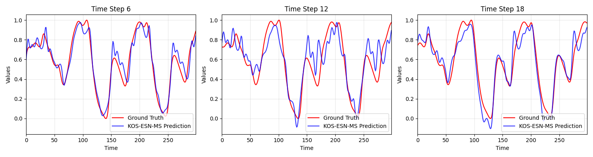
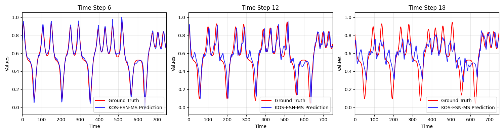

# kernel-online-sequential-echo-state-network-with-meanshift-based-filtering

> **Status:**  **Code Coming Soon!** > The complete source code and implementation details will be released after the peer-review and revision process is finalized. Stay tuned!

## Overview

This study proposed KOS-ESN-MS, a kernelized online sequential echo state network with MeanShift-based filtering, for non-stationary streaming time-series prediction in hydrological forecasting. By replacing random reservoir projections with deterministic Gaussian-kernel similarity evaluation, the proposed model reduces prediction variability and improves the representation of nonlinear temporal dynamics. In addition, the MeanShift-based mechanism constrains dictionary growth during online learning, thereby providing a better balance between forecasting accuracy and computational efficiency. 

## Results of Benchmark Datasets

Below are the forecasting performances of our proposed framework evaluated on two benchmark datasets Mackey-Glass(MG) and Lorenz times series datasets(LZ), demonstrating its capability to capture informative changes in streaming data for water level prediction. To examine the forecasting behavior at different stages, we have presented the predicted images for steps 6, 12 and 18, corresponding to three horizon ranges, short-term (1--6), medium-term (7--12) and long-term (13--18). 

### 1. Results on Mackey-Glass Time Series

*Figure 2: Forecasting performance and adaptive dictionary updates on the Mackey-Glass (MG) dataset.*
### 2. Results on Lorenz System

*Figure 1: Forecasting performance and adaptive dictionary updates on the Lorenz (LZ) dataset.*

## Datasets

The normalized synthetic benchmark datasets used in our experiments are provided in the `data/` folder:
* `norLorenz2500`: Normalized data for the Lorenz system.
* `norMG_data1000`: Normalized data for the Mackey-Glass time series.
